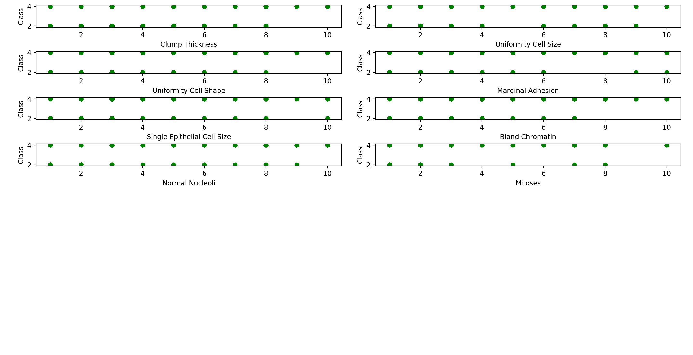

# breast-cancer-wisconsin
Analysis and prediction of breast cancer using data from Wisconsin Diagnostic Breast Cancer (WDBC).
https://archive.ics.uci.edu/ml/datasets/Breast+Cancer+Wisconsin+%28Diagnostic%29

# Usage
`python breast_cancer_wisconsin.py`

#  Analysis
## below is the correlations of the attributes with the Class column
CORRELATIONS WITH CLASS

|clump_thickness                |0.716001|
|-------------------------------|--------|
|uniformity_cell_size           |0.817904|
|uniformity_cell_shape          |0.818934|
|marginal_adhesion              |0.696800|
|single_epithelial_cell_size    |0.682785|
|bland_chromatin                |0.756616|
|normal_nucleoli                |0.712244|
|mitoses                        |0.423170|

You will notice that the variable 'mitoses' has low correlation with 'Class' so I will remove it from the classifier

and below is a scatter plot of the correlations

Running a Logistic Regression model on the data to classify which records are benign (2) or malignant (4) we see the following:

The Accuracy is **0.96**

Predictions Value Count

|label   |count|
|--------|-----|
|2    |444|
|4    |239|

Sensitivity is **0.95**
Specificity is **0.97**

Average Accuracies after 10 K-Folds: **0.96**